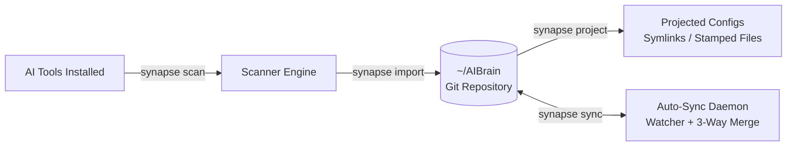

<div align="center">

# SYNAPSE
### llm-neuro-surgeon

**One Brain. All Models.**  
*Surgical precision. Zero friction.*

A local-first desktop app and CLI that unifies the configuration of every AI coding tool on your machine into one canonical, git-backed **Brain** (`~/AIBrain`) — then keeps every model in lockstep, automatically.

[](https://github.com/earnerbaymalay/llm-neuro-surgeon/actions/workflows/ci.yml)
[](CHANGELOG.md)
[](packages/e2e)
[](packages/core)
[](#architecture)
[](LICENSE)

**[Landing Page](brands/synapse/landing.html) · [Onboarding](docs/ONBOARDING.md) · [User Guide](docs/USER_GUIDE.md) · [Adapters](#13-verified-adapters) · [Architecture](#architecture)**

</div>

---

> [!NOTE]
> **Status: Production-Ready Release (v1.0.0)**  
> The Rust core engine (`packages/core`), CLI (`apps/cli`), Tauri v2 desktop GUI (`apps/desktop`), 13 tool adapters, auto-sync daemon, Doctor diagnostic engine, and full E2E test suite are 100% verified across Linux, macOS, and Windows.

---

## 💡 The Problem

You use more than one AI coding tool — Claude Code for reasoning, Cursor for iteration, Gemini CLI for refactors, Windsurf for flow, Copilot for autocomplete. Each tool speaks its own config dialect: `CLAUDE.md`, `.cursorrules`, `GEMINI.md`, `AGENTS.md`, `.windsurfrules`.

You are maintaining the same skills, rules, and MCP servers **N times**. Formats diverge, rules go stale, and every edit taxes your focus.

---

## ⚡ The Solution

Four verbs, one canonical Brain:



Edit once in **`~/AIBrain`**. Every model stays equally skilled. Every sync is a Git commit — a complete **Time Machine** for your AI configuration.

---

## ✨ Feature Pillars

| Pillar | Capability | Description |
|---|---|---|
| 🧠 **The Brain** | Single Source of Truth | Git-backed directory (`~/AIBrain`) holding all skills, agents, rules, memory, prompts, and MCP servers. |
| 📥 **Universal Import** | Lossless Ingestion | Purpose-built adapters ingest native configs from 13 AI coding tools without data loss. |
| 📤 **Projection Engine** | Target-Aware Output | Generates symlinks where supported, stamped files where required, with first-class `AGENTS.md` support. |
| 🔄 **Auto-Sync Daemon** | Background Lockstep | Debounced filesystem watcher + 3-way merge engine. Every sync creates a Git commit. |
| 🛒 **Marketplace** | Git Repo Ingestion | Import skills and agents from any Git repo (`anthropics/skills`), with license cards and SHA-256 provenance. |
| 🔌 **MCP Hub** | OS Keychain Integration | Search and health-check MCP servers; API keys stay securely stored in the OS Keychain via `${VAR}` placeholders. |
| 🩺 **Doctor** | Auto-Repair Engine | Health matrix across every tool and capability (`synapse doctor --fix` for one-command repairs). |
| 🛡️ **Safety First** | Local-First & Private | Zero telemetry. All path joins are traversal-safe; destructive operations snapshot working tree first. |

---

## 🔧 13 Verified Tool Adapters

```text
1. Claude Code / Desktop   (.claude/skills/, .claude/agents/, CLAUDE.md, .mcp.json)
2. Gemini CLI              (GEMINI.md, .gemini/settings.json)
3. OpenAI Codex CLI        (.codex/config.toml, .codex/instructions.md, AGENTS.md)
4. Cursor                  (.cursorrules, .cursor/rules/*.mdc)
5. Windsurf                (.windsurfrules, mcp_config.json)
6. Cline                   (.clinerules, cline_mcp_settings.json)
7. Roo Code                (.roomodes, .clinerules)
8. Aider                   (CONVENTIONS.md, .aider.conf.yml)
9. Continue                (.continue/rules/*.md, .continue/config.json)
10. GitHub Copilot         (.github/copilot-instructions.md)
11. Zed                    (.rules, .zed/settings.json, AGENTS.md)
12. OpenCode               (AGENTS.md)
13. Antigravity CLI        (AGENTS.md, .agy/skills/, .gemini/settings.json)
```

> [!TIP]
> Each adapter has a verified research brief in [`docs/research/`](docs/research/).

---

## 🏗️ Architecture

```mermaid
graph TD
    subgraph Interfaces
        UI[apps/desktop\nTauri 2 + React TS]
        CLI[apps/cli\nRust + Clap\nsynapse / neurosurgeon]
    end

    subgraph Core Engine [packages/core]
        SC[Scanner]
        AD[13 Tool Adapters]
        PR[Projector Engine]
        SY[Sync Daemon & 3-Way Merge]
        DR[Doctor Diagnostic Engine]
        MP[Marketplace Importer]
        KC[OS Keychain Secrets]
    end

    subgraph Storage
        BR[(~/AIBrain\nGit Time Machine)]
        FS[Tool Filesystems]
    end

    UI --> Core Engine
    CLI --> Core Engine
    Core Engine <--> BR
    Core Engine <--> FS
```

---

## 🚀 Quickstart

> [!IMPORTANT]
> **Prerequisites:** Rust 1.75+, Node.js 20+, Git.  
> *Linux System Dependencies:* `pkg-config`, `libgtk-3-dev`, `libwebkit2gtk-4.1-dev`, `libsoup-3.0-dev`, `libjavascriptcoregtk-4.1-dev`.

### 1. Terminal CLI (`synapse` / `neurosurgeon`)

```bash
# Scan installed AI tools
cargo run -p neurosurgeon -- scan

# Ingest existing tool configs (dry-run first)
cargo run -p neurosurgeon -- import --dry-run
cargo run -p neurosurgeon -- import

# Project Brain configs to all tools
cargo run -p neurosurgeon -- project

# Start background sync daemon
cargo run -p neurosurgeon -- sync --daemon

# Health check & auto-repair
cargo run -p neurosurgeon -- doctor --fix
```

### 2. Desktop GUI (React + Dark Precision UI)

```bash
cd apps/desktop
pnpm install
pnpm tauri dev
```

Walkthrough guide: [docs/ONBOARDING.md](docs/ONBOARDING.md)

---

## 📊 Quality & Test Metrics

- **142 / 142 E2E Vitest Tests Passing** (Sanity, Tier 1, Tier 2, Tier 3, Tier 4)
- **179 / 179 Rust Workspace Tests Passing** (Core, CLI, Stress, Updater)
- **0 Clippy Warnings · 100% Rustfmt Compliant** across Linux, macOS, and Windows.

---

## 📚 Documentation Index

- **[SYNAPSE Landing Page](brands/synapse/landing.html)** — Interactive product landing page
- **[Onboarding Guide](docs/ONBOARDING.md)** — Step-by-step 4-phase quickstart journey
- **[User Guide](docs/USER_GUIDE.md)** — Comprehensive CLI, Desktop GUI, MCP Hub, and Doctor reference
- **[Adapter Authoring Guide](docs/ADAPTER_AUTHORING_GUIDE.md)** — Build a custom tool adapter in Rust
- **[Security Audit](docs/security.md)** — Threat model, path safety, and symlink protection
- **[Brand System](brands/synapse/)** — Identity tokens, marketing pack, and social templates

---

## 🛡️ Security & Privacy

Local-first — every operation runs offline. API keys live in the OS Keychain; config files only ever reference them as `${VAR}` placeholders. All path joins are traversal- and symlink-escape safe. Zero telemetry.

## 📄 License

[MIT](LICENSE) © 2026 earnerbaymalay.
