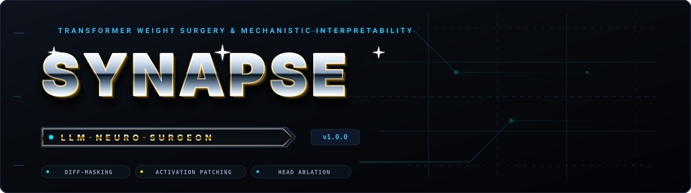

<div align="center">
  
</div>

### **One Brain. All Models. Surgical Precision. Zero Friction.**

*The local-first configuration engine that keeps every AI coding tool on your machine in permanent lockstep.*

[](https://earnerbaymalay.github.io/llm-neuro-surgeon/)
[](docs/README.md)
[](https://www.rust-lang.org)
[](https://tauri.app)
[](LICENSE)

[🌐 View Live Website](https://earnerbaymalay.github.io/llm-neuro-surgeon/) • [⚡ 60s Quickstart](docs/QUICKSTART.md) • [📚 Documentation Hub](docs/README.md) • [🔧 13 Tool Adapters](docs/adapters/README.md) • [🤝 Contributing](docs/development/CONTRIBUTING.md)

---

</div>

## 💡 What is Synapse (LLM-NeuroSurgeon)?

**Synapse (LLM-NeuroSurgeon)** is the local-first configuration engine and synchronizer that keeps Claude Code, Cursor, Gemini CLI, Windsurf, Zed, and 8+ other AI coding companions in permanent lockstep.

```
                     ┌────────────────────────┐
                     │       ~/AIBrain        │
                     │  (Single Source Truth) │
                     └───────────┬────────────┘
                                 │
        ┌──────────────┬─────────┴────────┬──────────────┐
        ▼              ▼                  ▼              ▼
   Claude Code       Cursor           Gemini CLI      Windsurf / Zed
  (`.claude/`)   (`.cursorrules`)    (`GEMINI.md`)    (`.windsurfrules`)
```

---

## ⚡ 60-Second Quickstart

```bash
# 1. Detect active AI coding tools on your machine
cargo run -p neurosurgeon -- scan

# 2. Ingest configurations into ~/AIBrain (Git-backed repository)
cargo run -p neurosurgeon -- import --dry-run
cargo run -p neurosurgeon -- import

# 3. Launch background auto-sync daemon with 3-way merge resolution
cargo run -p neurosurgeon -- sync --daemon
```

For full setup prerequisites across Linux, macOS, and Windows, read the **[Quickstart Guide](docs/QUICKSTART.md)**.

---

## 📚 Documentation Index

| Guide | Description | Target |
|---|---|---|
| **[Docs Hub](docs/README.md)** | Centralized documentation navigation & command reference | All users & contributors |
| **[Quickstart](docs/QUICKSTART.md)** | Step-by-step setup in under 60 seconds | First-time setup |
| **[User Guide](docs/USER_GUIDE.md)** | Day-to-day workflow, daemon sync, MCP hub & Doctor self-healing | Daily development |
| **[Architecture](docs/ARCHITECTURE.md)** | 3-way merge engine, file system watcher & monorepo layout | Engine internals |
| **[Adapters Hub](docs/adapters/README.md)** | Complete matrix and individual adapter specifications | Tool dialect reference |
| **[Contributing](docs/development/CONTRIBUTING.md)** | PR lifecycle, test requirements & coding standards | Open source contributors |

---

## 🩺 The Doctor: Self-Healing Configurations

When tool configurations drift or symlinks break, Synapse detects and repairs the issue automatically:

```bash
cargo run -p neurosurgeon -- doctor
cargo run -p neurosurgeon -- doctor --fix
```

---

<div align="center">
<sub>Built with Rust, Tauri 2, and React. Open source under the MIT License.</sub>
</div>
